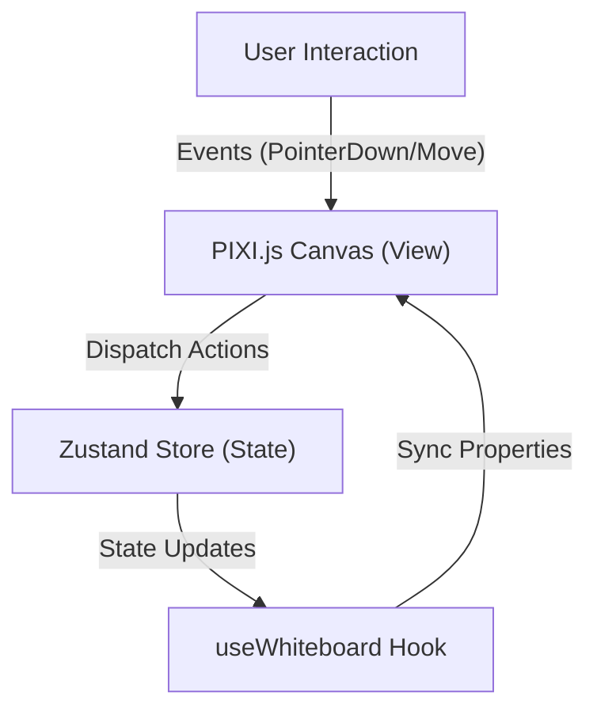

# Whiteboard Application

A high-performance whiteboard application using React, Zustand, and PIXI.js.

## 🚀 Getting Started

### Prerequisites

- Node.js (Latest LTS recommended)
- NPM or Yarn

### Installation

If you haven't already install the dependencies from the root of the workspace:

```bash
npm install
```

### Running the App

To start the development server for the whiteboard application:

```bash
npx nx serve @org/whiteboard
```

This will launch the application (usually at `http://localhost:4200`).

---

## Architecture

This application follows a strict separation of concerns between the **State** (Single Source of Truth) and the **View** (Render Layer).

### 1. State Management (The "Brain")

We use **Zustand** as the single source of truth for the application state.

- **`nodeStore`**: Manages the data model of all objects (nodes) on the whiteboard (images, videos, text, etc.), including their properties like position `(x, y)`, `scale`, `rotation`, and content.
- **`whiteboardStore`**: Manages the transient UI state, such as:
  - Currently selected object.
  - Transformation modes (Drag, Scale, Rotate).
  - Interaction state.

### 2. View / Preview Layer (The "Screen")

**PIXI.js** acts purely as the **Preview Layer** or rendering engine.

- **It is NOT the source of truth.**
- It _subscribes_ to changes in the Zustand stores and efficiently updates the canvas to reflect those changes.
- It captures user interactions (pointer events) and _dispatches actions_ back to the store.

### 3. Data Flow Cycle

1.  **Render**: The `useWhiteboard` hook synchronizes the Zustand state to PIXI sprites.
2.  **Interact**: User drags or rotates an object on the PIXI canvas.
3.  **Dispatch**: The interactivePIXI event handlers call store actions (e.g., `updateTransformState`, `updateNode`).
4.  **Update**: The Store updates its state.
5.  **Re-render**: The cycle repeats as the view subscribes to these updates.



### Key Components

- **`useWhiteboard.ts`**: The bridge between React/Zustand and PIXI.js. It handles the manual syncing of state to sprites to avoid React's reconciliation overhead for high-frequency updates (like 60fps dragging).
- **`WhiteboardCanvas.tsx`**: The React entry point that mounts the PIXI application.
- **`useNodeStore`** (in `nodeStore.ts`): The Zustand store accessor for creating and updating whiteboard nodes.
